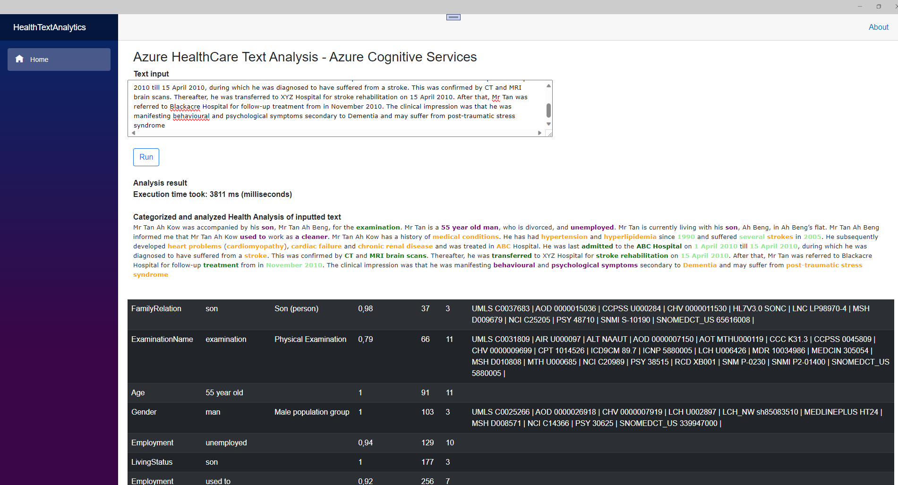

# ToreAurstadIT.HealthTextAnalytics

## Health Text Analytics
This repo contains a Github repo for a .NET MAUI Blazor app that uses 
Azure Cognitive Services and the Language Resource service. 
Specifially, text analytics for healthcare is used here.
This functionality analysis text and extracts information around the text
inputted. The format returned is in fhir data and fhir bundle together with
overall data. 



The tool at https://json2csharp.com/ website was used to generate the domain classes.
To get FHIR data back from Azure service, we must use REST API. The downside of this 
is that it is some more manual work like deserializing sample json into classes as mentioned.

Also, it is necessary to poll the service until a result is available. Typically, 
some 5-10 sentences will take about 3-4 seconds to process. The repo retrieves this
information in a polling behavior, polling every 0.5 second if a result is available.

The request to the service is built up like this in <b>HealthAnalyticsTextHelper</b>:

```csharp
 public static string CreateRequest(string inputText)
    {
        //note - the id 1 here in the request is a 'local id' that must be unique per request. only one text is supported in the 
        //request genreated, however the service allows multiple documents and id's if necessary. in this demo, we only will send in one text at a time
        var request = new
        {
            analysisInput = new
            {
                documents = new[]
                {
                    new { text = inputText, id = "1", language = "en" }
                }
            },
            tasks = new[]
            {
                new { id = "analyze 1", kind = "Healthcare", parameters = new { fhirVersion = "4.0.1" } }
            }
        };
        return JsonSerializer.Serialize(request, new JsonSerializerOptions { WriteIndented = true });
    }

```

Polling is done like this (with the help of some helper methods) in <b>HealthAnalyticsTextClientService</b>:

```csharp

  public async Task<HealthTextAnalyticsResponse> GetHealthTextAnalytics(string inputText)
        {
            var client = _httpClientFactory.CreateClient("Az");
            string requestBodyRaw = HealthAnalyticsTextHelper.CreateRequest(inputText);
            //https://learn.microsoft.com/en-us/azure/ai-services/language-service/text-analytics-for-health/how-to/call-api?tabs=ner
            var stopWatch = Stopwatch.StartNew();
            HttpRequestMessage request = CreateTextAnalyticsRequest(requestBodyRaw);
            var response = await client.SendAsync(request);
            var result = new HealthTextAnalyticsResponse();
            var timer = new PeriodicTimer(TimeSpan.FromMilliseconds(awaitTimeInMs));
            int timeAwaited = 0;

            while (await timer.WaitForNextTickAsync())
            {
                if (response.IsSuccessStatusCode)
                {
                    result.IsSearchPerformed = true;
                    var operationLocation = response.Headers.First(h => h.Key?.ToLower() == Constants.Constants.HttpHeaderOperationResultAvailable).Value.FirstOrDefault();

                    var resultFromHealthAnalysis = await client.GetAsync(operationLocation);
                    JsonNode resultFromService = await resultFromHealthAnalysis.GetJsonFromHttpResponse();
                    if (resultFromService.GetValue<string>("status") == "succeeded")
                    {
                        result.AnalysisResultRawJson = await resultFromHealthAnalysis.Content.ReadAsStringAsync();
                        result.ExecutionTimeInMilliseconds = stopWatch.ElapsedMilliseconds;
                        result.Entities.AddRange(HealthAnalyticsTextHelper.GetEntities(result.AnalysisResultRawJson));
                        result.CategorizedInputText = HealthAnalyticsTextHelper.GetCategorizedInputText(inputText, result.AnalysisResultRawJson);
                        break;
                    }
                }
                timeAwaited += 500;
                if (timeAwaited >= maxTimerWait)
                {
                    result.CategorizedInputText = $"ERR: Timeout. Operation to analyze input text using Azure HealthAnalytics language service timed out after waiting for {timeAwaited} ms.";
                    break;
                }
            }

            return result;
        }

```

We create a http client via IHttpClientContextFactory like this via a specification in <b>MauiProgram.cs</b>: 

```csharp

        var azureEndpoint = Environment.GetEnvironmentVariable("AZURE_COGNITIVE_SERVICES_LANGUAGE_SERVICE_ENDPOINT");
        var azureKey = Environment.GetEnvironmentVariable("AZURE_COGNITIVE_SERVICES_LANGUAGE_SERVICE_KEY");

        if (string.IsNullOrWhiteSpace(azureEndpoint))
        {
            throw new ArgumentNullException(nameof(azureEndpoint), "Missing system environment variable: AZURE_COGNITIVE_SERVICES_LANGUAGE_SERVICE_ENDPOINT");
        }
        if (string.IsNullOrWhiteSpace(azureKey))
        {
            throw new ArgumentNullException(nameof(azureKey), "Missing system environment variable: AZURE_COGNITIVE_SERVICES_LANGUAGE_SERVICE_KEY");
        }

        var azureEndpointHost = new Uri(azureEndpoint);

        builder.Services.AddHttpClient("Az", httpClient =>
        {
            string baseUrl = azureEndpointHost.GetLeftPart(UriPartial.Authority); //https://stackoverflow.com/a/18708268/741368
            httpClient.BaseAddress = new Uri(baseUrl);
            //httpClient..Add("Content-type", "application/json");
            //httpClient.DefaultRequestHeaders.Accept.Add(new MediaTypeWithQualityHeaderValue("application/json"));//ACCEPT header
            httpClient.DefaultRequestHeaders.Add("Ocp-Apim-Subscription-Key", azureKey);
        });

```

This app expects two environment variables (at system level). This is the key and the endpoint which is created for a <em>Language Service</em> 
in Azure Cognitive Services. 

The code has been tested and works against the Norway East data center, the text used in demo is english. Azure got good functionality to translate from a multitude
of languages into english, which then can process the text using health text analytics.

A list of supported languages in Health Text Analysis is listed here  :point_down:

https://learn.microsoft.com/en-us/azure/ai-services/language-service/text-analytics-for-health/language-support

The different extracted information is listed with <em>links</em> that specifies what the different
information means. 

A Snomed CT browser is available here for example:
https://termbrowser.nhs.uk/?perspective=full&conceptId1=404684003&edition=uk-edition&release=v20230927&server=https://termbrowser.nhs.uk/sct-browser-api/snomed&langRefset=999001261000000100,999000691000001104

By looking up <em>Snomed codes</em> it is possible to read more information about each term, for example about 
a diagnosis or procedure.

It is possible to customize this too, for example we could add perhaps links towards Norwegian data sources such as NCSP, NCMP and Legemiddelhaandboken.
This is not included in this demo though, but a more advanced topic.

<br />
<code>
Last update:
19.10.2023
Tore Aurstad IT
</code>